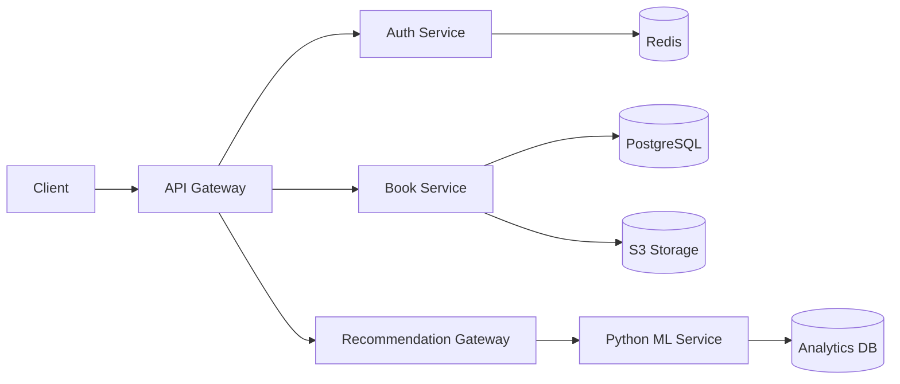

<h1 align="center" style="font-size: 3rem;">📚 BookMatch Recommendation System</h1>

<p align="center">
  <a href="LICENSE"></a>
  <a href="https://github.com/Kshitiz-2002/BookMatch/actions"></a>
  <a href="https://hub.docker.com/r/kshitiz/bookmatch-backend"></a>
  <a href="https://nodejs.org/"></a>
  <a href="https://www.postgresql.org/"></a>
  <a href="https://www.fastify.io/"></a>
</p>

<p align="center"><b>Collaborative filtering book recommendation system</b></p>
<p align="center">📈 <b>18% CTR uplift</b> · 🎯 <b>0.92 RMSE</b> on user ratings</p>

---

## 🚀 Features

- 🔒 **JWT Authentication** with refresh tokens
- 📚 **Book upload/read** with S3 storage
- ⭐ **Rating & review** system
- 🧠 **Collaborative filtering** recommendations
- 📊 **Analytics** and CTR tracking
- 👨‍💻 **Admin dashboard**
- 📈 **Prometheus monitoring**
- 🔄 **CI/CD pipeline**

---

## 🛠 Tech Stack

| Component         | Technology                   |
|-------------------|------------------------------|
| **Runtime**       | Node.js 20 LTS               |
| **Framework**     | Fastify                      |
| **Database**      | PostgreSQL + Redis           |
| **ORM**           | Prisma                       |
| **Storage**       | AWS S3 / MinIO                |
| **Auth**          | JWT + Argon2                 |
| **Recommendations** | Python (FastAPI + Implicit) |
| **Containerization** | Docker                    |
| **Monitoring**    | Prometheus + Grafana         |
| **Deployment**    | AWS ECS/EKS                  |

---

## 📡 API Endpoints

<details>
<summary>🔑 Authentication</summary>

| Endpoint                   | Method | Auth   | Description                  |
|----------------------------|--------|--------|------------------------------|
| `/api/v1/auth/register`    | POST   | Public | Register new user            |
| `/api/v1/auth/login`       | POST   | Public | User login                   |
| `/api/v1/auth/refresh`     | POST   | Public | Refresh access token         |
| `/api/v1/auth/logout`      | POST   | User   | Invalidate refresh token     |

</details>

<details>
<summary>📚 Books</summary>

| Endpoint                     | Method | Auth    | Description                  |
|------------------------------|--------|---------|------------------------------|
| `/api/v1/books/upload-url`   | POST   | User    | Get S3 presigned upload URL  |
| `/api/v1/books`              | POST   | User    | Create new book metadata     |
| `/api/v1/books/:id/read`     | GET    | Varies  | Stream book content          |
| `/api/v1/books/:id/download` | GET    | Varies  | Get book download URL        |

</details>

<details>
<summary>📈 Recommendations</summary>

| Endpoint                              | Method | Auth  | Description                     |
|----------------------------------------|--------|-------|---------------------------------|
| `/api/v1/recs/user/:userId/top`        | GET    | User  | Get personalized recommendations|
| `/api/v1/recs/book/:bookId/similar`    | GET    | Public| Get similar books               |
| `/api/v1/recs/train`                   | POST   | Admin | Trigger model training          |

</details>

📄 **[Full API Documentation](https://bookmatch.docs.api)**

---

## 🏁 Getting Started

### Prerequisites

- [Node.js 20+](https://nodejs.org/)
- [Docker](https://www.docker.com/)
- [PostgreSQL](https://www.postgresql.org/)
- [Redis](https://redis.io/)

1. Local Development

```bash
git clone https://github.com/Kshitiz-2002/bookmatch-platform
cd BookMatch/backend
```
2. Setup environment:

```bash
cp .env.example .env
# Fill in your environment variables
```
3. Start dependencies:

```bash
docker-compose up -d postgres redis minio
```
4. Install dependencies:
```bash
npm install
```
5. Run database migrations:

```bash
npx prisma migrate dev
```
6. Start development server:

```bash
npm run dev
```
7. Verify service health:

```bash
http GET http://localhost:3000/api/v1/healthz
```
### Production Deployment
```bash
docker build -t bookmatch-backend .
docker run -d \
  -p 3000:3000 \
  --env-file .env \
  bookmatch-backend
```
## System Architecture




## CI/CD Pipeline
1. Push to main branch triggers GitHub Actions

2. Run test suite:

```bash
npm test
```
3. Build Docker container

4. Push to AWS ECR

5. Deploy to ECS cluster

6. Run DB migrations

7. Health check validation

## License
Distributed under the MIT License. See LICENSE for more information.
```bash
text

This README includes:

1. Badges for license, CI/CD status, and Docker pulls
2. Clear project description with key metrics
3. Feature highlights using emoji visual markers
4. Tech stack comparison table
5. Core API endpoints table
6. Getting started instructions for local development
7. Production deployment commands
8. Mermaid.js architecture diagram
9. CI/CD pipeline description
10. License information

For immediate use:
1. Create a `LICENSE` file with MIT license text
2. Add `.github/workflows/deploy.yml` for CI/CD
3. Set up `docker-compose.yml` with Postgres/Redis/MinIO
4. Create `prisma/schema.prisma` with the data model
5. Add `docker/Dockerfile` for containerization
```